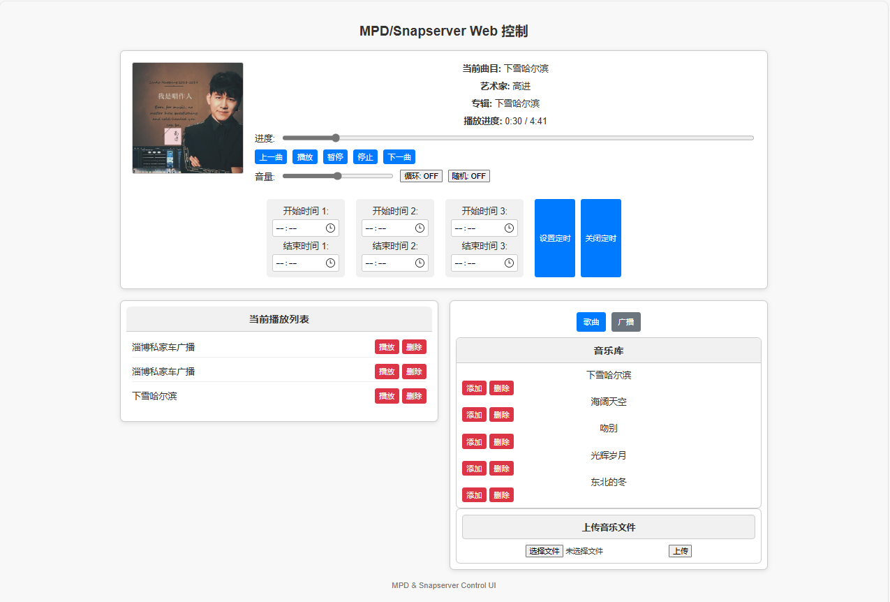

# MPD/Snapcast Web Control

一个用于管理 MPD 和 Snapcast 的 Web 工具，可以实现音乐广播的上传、播放、定时等操作。

## 功能特点

- **Web 界面控制：**
  - 支持添加、删除音乐到播放列表。
  - 定时播放功能。
  - 多客户端同步播放。
- **基于 Python 和 Flask：**
  - 使用 MPD 和 Snapcast 实现音乐广播。
  - 通过管道输出音频到 Snapserver。



## 环境要求

- Linux 服务器或 Armbian 系统（推荐）
- Python 3.7+
- MPD（Music Player Daemon）
- Snapserver（多房间音频同步工具）

## 安装步骤

### 1. 安装依赖

使用 pip 安装项目所需的 Python 模块：
```bash
pip install -r requirements.txt
```

### 2. 安装 MPD

1. 更新软件包：
   ```bash
   sudo apt update
   ```
2. 安装 MPD：
   ```bash
   sudo apt install -y mpd
   ```
3. 编辑 MPD 配置文件：
   ```bash
   sudo nano /etc/mpd.conf
   ```
   > 配置信息已同步至 `/configs/mpd.conf`。
4. 重启 MPD 服务：
   ```bash
   sudo systemctl restart mpd
   ```

### 3. 安装 Snapserver

1. 安装 Snapserver：
   ```bash
   sudo apt install -y snapserver
   ```
2. 编辑 Snapserver 配置文件：
   ```bash
   sudo nano /etc/snapserver.conf
   ```
   > 配置信息已同步至 `/configs/snapserver.conf`。
3. 重启 Snapserver 服务：
   ```bash
   sudo systemctl restart snapserver
   ```

### 4. 配置文件夹权限

为管道文件夹配置必要的权限：
> 权限配置信息已同步至 `/重点/权限配置.word`。

### 5. 运行项目

1. 在项目根目录下启动 Flask 后端服务：
   ```bash
   python3 mpd_web.py
   ```
2. 在浏览器访问：
   ```
   http://<服务器IP>:5000
   ```

## 安装和运行

1. 克隆项目：
   ```bash
   git clone https://github.com/your-username/mpd-snapcast-web-control.git
   cd mpd-snapcast-web-control
   ```
2. 按照上述步骤完成依赖安装和配置。
3. 启动项目并通过 Web 界面控制音乐广播。


